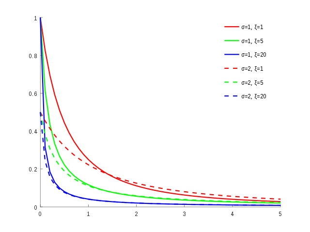
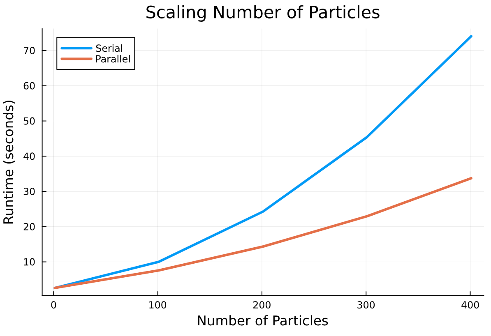

# Welcome to `GHost`

`GHost` is a two dimensional gravitational n-body simulation that simulates the movement of particles around a single Gravitational Host (GHost). 
This can be applied to planetary rings, planetary nebulae, and accretion disks around a single host (planet, star, compact object, etc.).

`GHost` currently only contains functionality for resolving/updating the positions of particles around the host in accordance with simple, analytical forms of Newton's law of gravity and kinematics.
In the future, we hope to include more complex physical processes, such as upgrading to three spatial dimensions, radiative transfer, formation of moonlets/planets, and radiation generation. 
Here is a list of tasks that were originally proposed for this project:

- Implement a probability distribution for initial particle masses (bottom-heavy generalized Pareto, but could be made for other distributions).
- Implement randomized initial conditions (positions only, velocities determined as a percentage of minimum orbital velocity by the user).
- Create an animation to visually display results.
- Determine if basic analytic (i.e., without a ODE solvers or an integration step) Newton's laws fail to replicate real life with the assumptions made in the simulation.
- Examine energy gain/loss over the simulated time frame.

It fundamentally uses a randomized set of initial conditions for particles around the host, along with specified conditions given by the user, which include:

- Particle dynamical range
- Initial velocity of particles
- Host mass
- Host radius
- Number of particles
- Number of time steps
- Time step size

## Variable Walkthrough

Here is a brief description of the input variables that will be used in the initital set up of any simulation (also found in the documentation/description of `create_animation.jl`):

- `M_planet` (Real > 0): Mass of planetary body in kg. 
- `R_planet` (Real > 0): Radius of planetary body in m. 
- `n` (Int > 0): Number of dust particles (Int). It's best to keep this between 1 < n ≤ 1000 unless doing some heavy testing.
- `r_min` (Real > 1.0): Minimum distance away from the center of the planetary body that particles will be placed for the initial conditions (in units of planetary radii, so must be greater than 1).
- `r_max` (Real > `r_min`): Maximum distance away from the center of the planetary body that particles will be placed for the initial conditions (in units of planetary radii, so must be greater than 1, and must also be greater than `r_min`). I recommend that this is kept at less than 10 planet radii so that all particles are able to be seen in the animation.
- `m_min` (Real > 0): Minimum dust particle mass in units of planetary masses. 
- `m_max` (Real > `m_min`): Maximum dust particle mass in units of planetary masses. Don't push this past 10^(-5), as it causes some numerical issues... (will need to be addressed at some point)
- `num_steps` (Int ≥ 0): Number of iterations for the orbital calculations to be completed.
- `step_size` (Int > 0): The time that passes between each iteration (temporal resolution) in units of days. It's best to keep this above 0.0001 days to avoid long run times.
- `V_initial` (Real >= 0): Fraction of minimum orbital speed that is the particle's intitial tangential velocity. Keep below 1 if you don't want the particles speed off to infinity.
- `output_rate` (Int > 0): Output every i'th frame of the final animation (saves on some computation, in addition to making the animation to speed up without having to watch it very slowly)
- `fps` (Int > 0): Frames per second rate of final animation (default 30 fps).
- `seed`(Int > 0): Random seed to populate initial conditions.
- `parallel` (Bool): Optional parameter to indicate the functions to be run in parallel. 

## Methods 

### Initial Conditions

#### Mass Distribution

The mass of particles is defined in the function `create_masses.jl`. The distribution of particle masses is defined by a generalized Pareto probability density function (very bottom heavy), which goes as:

$$
F_{\xi} (z) = \left\{
\begin{array}{ll}
    1 - (1 + \xi z) ^{-\frac{\xi + 1}{\xi}}  & \mathrm{for}\ \xi \neq 0, \\
   e^{z} & \mathrm{for} \  \xi = 0 \\
\end{array}
\right.
$$

where $z = \frac{x - \mu}{\sigma}$. $\mu$ is the location (real) of the maximum of the distribution, $\sigma$ is the scale (how the peak of the distribution behaves, the higher it is, the lower the peak), and $\xi$ is the shape of the function (the higher this number, the more concentrated the population is at the location).

For our purposes, we normalize this function to the range of particle masses specified by the user. 

This distribution is displayed below

#### Particle Positions and Velocities

The initial position of all particles is calculated in the function `initial_conditions.jl`. The polar coordinates of a particle (in units of host radii) is determined by a random azimuthal direction (in radians, between 0 and 2$\pi$), and a random radial position within the bounds of [`r_min`,`r_max`], as defined by the user in terms of host radii. 

To determine velocities, the orbital speed of a given particle goes as:

$$
v = f\sqrt{\frac{G M_{host}}{r}}
$$

Where $G$ is the gravitational constant in units of $\mathrm{\frac{R_{host}^3}{M_{host} days^{2}}}$, $M_{host}$ is the mass of the host in units of host masses (equivalent to 1), $r$ is the particle's radius from the center of the host/origin, and $f$ is a number set by the user to determine the fraction of this speed is given to the particle.

### Particle Conditions at each Time Step

For a given time step, the function `move_particle.jl` calculates the net acceleration on each particle, and the corresponding velocity and position change due to the acceleration over the course of one time step. 

#### Acceleration

The acceleration acting on a particle is calculated in `acceleration.jl`, which contains the two functions `acceleration` and `acceleration_loop`. `acceleration.jl` has the option to be parallelizable, where `acceleration_loop` acts as the core calculations completed, regardless of serial or parallelized processes. 

Within `acceleration_loop`, which performs on a given particle, $i$, at a given time $t$, will calculate the acceleration due to the host, followed by every other particle. The acceleration by the host is calculated via:

$$
	F_g = m_ia = \frac{Gm_i M_{host}}{r_i^2} \\  
	a = \frac{GM_{host}}{x_i^2 + y_i^2} \\
	a_x = \frac{GM_{host}}{x_i^2 + y_i^2}\cos\theta \quad \quad  \ a_y = \frac{GM_{host}}{x_i^2 + y_i^2}\sin\theta \\
	 \ \\
	a_x = \frac{GM_{host}}{x_i^2 + y_i^2}\frac{x_i}{r_i} \quad \quad  \ a_y = \frac{GM_{host}}{x_i^2 + y_i^2}\frac{y_i}{r_i} \\
	 \ \\
	a_x = \frac{GM_{host}x_i}{(x_i^2 + y_i^2)^{3/2}} \quad \quad  \ a_y = \frac{GM_{host}y_i}{(x_i^2 + y_i^2)^{3/2}} \\
$$

where $m_i$ is the mass of a particle in units of host masses, $G$ is the gravitational constant in units of $\mathrm{\frac{R_{host}^3}{M_{host} days^{2}}}$, $M_{host}$ is the mass of the host in units of host masses (equivalent to 1), and [$x_i,y_i$] are the cartesian coordinates of the particle. Note that the host is always located at the origin, so the radial distance between the host and the particle is simply based off the particle's current position.

To calculate the acceleration from another particle, $j$, we perform a similar calculation:

$$
	F_g = m_ia = \frac{Gm_i m_j}{r_{ij}^2} \\ 
	a = \frac{Gm_j}{x_{ij}^2 + y_{ij}^2} \\
	a_x = \frac{Gm_j}{(x_j - x_i)^2 + (y_j - y_i)^2}\cos\theta \quad \quad  \ a_y = \frac{Gm_j}{(x_j - x_i)^2 + (y_j - y_i)^2}\sin\theta \\
	 \ \\
	a_x = \frac{Gm_j}{(x_j - x_i)^2 + (y_j - y_i)^2}\frac{x_i}{r_i} \quad \quad  \ a_y = \frac{Gm_j}{(x_j - x_i)^2 + (y_j - y_i)^2}\frac{y_i}{r_i} \\
	 \ \\
	a_x = \frac{Gm_jx_i}{((x_j - x_i)^2 + (y_j - y_i)^2)^{3/2}} \quad \quad  \ a_y = \frac{Gm_jy_i}{((x_j - x_i)^2 + (y_j - y_i)^2)^{3/2}} \\
$$

#### Velocity Change

Using the result from `acceleration.jl`, we can use `velocity_change.jl` to determine the appropriate change in velocity for a particle. For a time step, $dt$:

$$
v_{t,x} = v_{t-1,x} + a_{t,x}dt \quad \quad v_{t,y} = v_{t-1,y} + a_{t,y}dt
$$

#### Position Change

Using the result from `acceleration.jl` and `velocity_change.jl`, we can use `position_change.jl` to determine the appropriate change in position for a particle.

$$
x_t = x_{t-1} +  v_{t,x}dt + \frac{1}{2}a_{t,x}dt^2 \quad \quad y_t = y_{t-1} +  v_{t,y}dt + \frac{1}{2}a_{t,y}dt^2
$$

#### Particle Infall 

Note that infall into the host is accounted for. If the radial distance from the origin is less than the host radius (<1 in units of most radii), then the position of the particle is automatically updated to be [0.,0.] (at the center of the host/origin). Every time step thereafter, the particle will remain at the origin, and will still participate in acceleration calculations on every other particle. Note that no acceleration calculations will be performed on the particle itself (automatically set to 0). This may introduce some delineation from total energy conservation.
 
## Parallelization of Project

* Choice of portion of code to parallelize
    * The function `acceleration` in  `acceleration.jl` contain parallelization. 
* Choice of approach for parallelizing code
	* `ThreadsX` is utilized in `acceleration.jl`
* Code performs proposed tasks
	* See proposed tasks above. 
* Unit/regression tests comparing serial & parallel versions
	* See `runtests.jl` in the `/test` directory.
* Code passes tests
	* See `runtests.jl` in the `/test` directory.
* General code efficiency
    * 
* Implementation/optimization of multi-core parallelization
	* For implementation of multi-core parallelization, see `acceleration.jl` in the `/src` directory.
* Significant performance improvement
	* See serial v. parallel. comparisons in this README file.

 ### Serial v. Parallel 

 As can be seen in test file, `GHost_trial.ipynb`, we tested the runtimes of different sized problems for the parallel and serialized version of `Ghost`. 
In this figure, we looked at the number of particles (excluding the host) that was resolved by the simulation in both serial and parallel versions (note this is using 6 cores). 

It can especially be seen that when the problem exceeds over 400 particles, the runtime decreases by 50%! 

This same process can be applied to the total number of timesteps, but after some initial testing, there is no significant reduction of runtime. 
